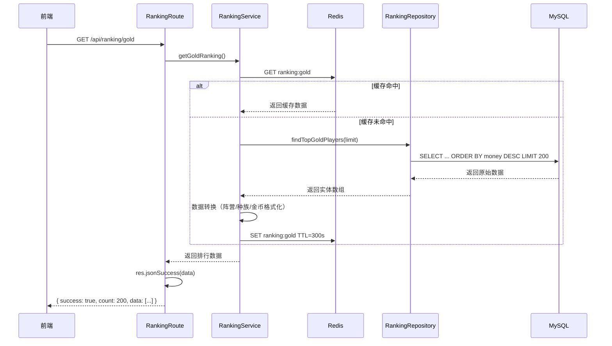
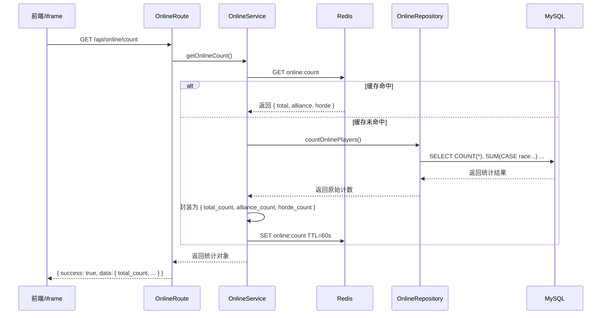
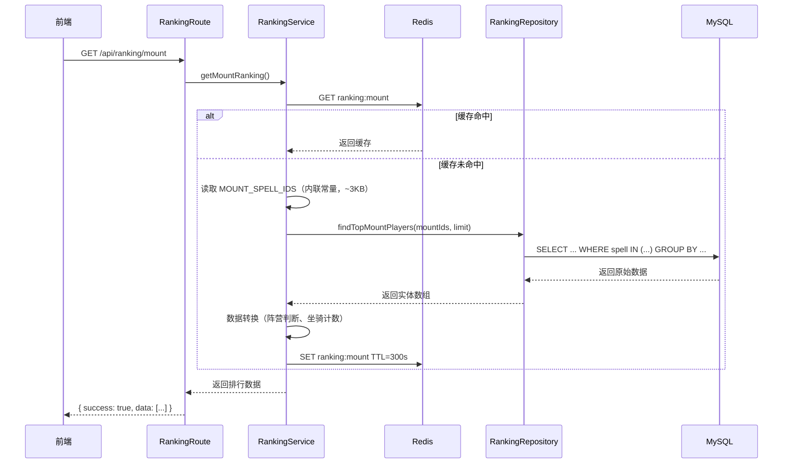
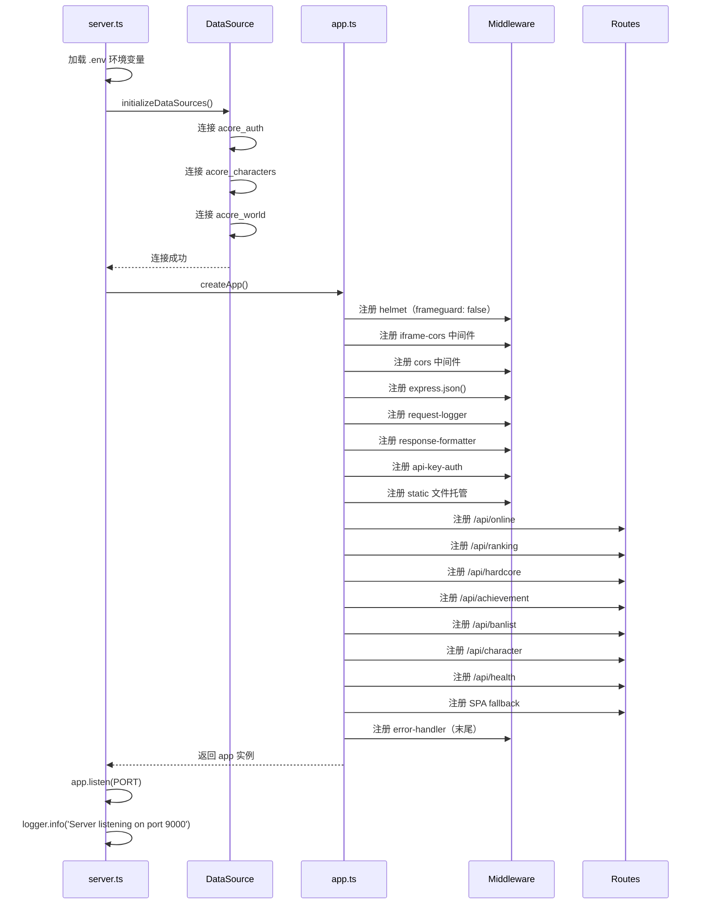

# acore-ranking 后端架构设计

## 一、后端技术栈

| 技术栈 | 版本 | 说明 |
|-------|------|------|
| **Node.js** | 20+ | 运行环境 |
| **Express** | 4.21+ | 轻量 Web 框架 |
| **TypeScript** | 5.3+ | 类型安全 |
| **TypeORM** | 0.3+ | ORM，已验证与 AzerothCore 兼容 |
| **ioredis** | 5+ | Redis 客户端 |
| **pino** | 9+ | 高性能结构化日志 |
| **cors** | 2.8+ | CORS 跨域中间件 |
| **helmet** | 7+ | 安全响应头中间件 |
| **express-validator** | 7+ | 请求参数校验 |

---

## 二、后端目录结构

### 2.1 完整目录组织

```
backend/
├── src/
│   ├── app.ts                      # Express 应用配置（中间件、路由注册）
│   ├── server.ts                   # 服务器启动入口
│   │
│   ├── config/                     # 配置模块
│   │   ├── database.ts             # 数据库连接配置（多数据源 TypeORM）
│   │   ├── redis.ts                # Redis 连接配置
│   │   └── env.ts                  # 环境变量校验与加载
│   │
│   ├── middleware/                 # Express 中间件
│   │   ├── error-handler.ts        # 全局异常处理中间件
│   │   ├── request-logger.ts       # 请求日志中间件
│   │   ├── response-formatter.ts   # 统一响应格式化中间件
│   │   ├── api-key-auth.ts         # API Key 鉴权中间件
│   │   └── iframe-cors.ts          # iframe CORS / CSP 响应头中间件
│   │
│   ├── entities/                   # TypeORM 实体（复用 acore-api 定义）
│   │   ├── auth/                   # auth 数据库实体
│   │   │   ├── account.entity.ts
│   │   │   └── account-banned.entity.ts
│   │   ├── characters/             # characters 数据库实体
│   │   │   ├── characters.entity.ts
│   │   │   ├── character-achievement.entity.ts
│   │   │   ├── character-spell.entity.ts
│   │   │   ├── character-inventory.entity.ts
│   │   │   ├── hardcore-challenge-completed.entity.ts
│   │   │   ├── hardcore-challenge-failed.entity.ts
│   │   │   └── item-instance.entity.ts
│   │   └── world/                  # world 数据库实体
│   │       ├── achievement-dbc.entity.ts
│   │       └── item-template.entity.ts
│   │
│   ├── repositories/               # 数据访问层（Repository Pattern）
│   │   ├── base.repository.ts      # 基础仓储（封装通用查询）
│   │   ├── character.repository.ts # 角色相关查询
│   │   ├── online.repository.ts    # 在线统计查询
│   │   ├── ranking.repository.ts   # 排行查询
│   │   ├── hardcore.repository.ts  # 硬核模式查询
│   │   ├── achievement.repository.ts
│   │   └── banlist.repository.ts
│   │
│   ├── services/                   # 业务逻辑层（核心业务实现）
│   │   ├── online.service.ts       # 在线统计业务
│   │   ├── ranking.service.ts      # 综合排行业务
│   │   ├── hardcore.service.ts     # 硬核模式业务
│   │   ├── achievement.service.ts  # 成就业务
│   │   ├── banlist.service.ts      # 封禁列表业务
│   │   ├── character.service.ts    # 角色信息业务
│   │   └── cache.service.ts        # Redis 缓存封装
│   │
│   ├── routes/                     # 路由层（薄路由，仅 HTTP 处理）
│   │   ├── online.routes.ts
│   │   ├── ranking.routes.ts
│   │   ├── hardcore.routes.ts
│   │   ├── achievement.routes.ts
│   │   ├── banlist.routes.ts
│   │   ├── character.routes.ts
│   │   └── health.routes.ts
│   │
│   ├── shared/                     # 共享工具
│   │   ├── enums/
│   │   │   ├── faction.enum.ts
│   │   │   ├── race.enum.ts
│   │   │   └── class.enum.ts
│   │   ├── utils/
│   │   │   ├── faction.util.ts
│   │   │   ├── time.util.ts
│   │   │   └── gold.util.ts
│   │   └── constants/
│   │       ├── game.constants.ts
│   │       └── mount-spell-ids.ts  # 坐骑 spell ID 列表（~3KB）
│   │
│   └── types/                      # TypeScript 类型定义
│       └── express.d.ts
│
├── test/                           # 测试目录
│   ├── unit/                       # 单元测试（Services / Repositories / Utils）
│   │   ├── services/
│   │   ├── repositories/
│   │   └── utils/
│   └── e2e/                        # E2E 测试（API 路由端到端）
│       ├── online.e2e.test.ts
│       ├── ranking.e2e.test.ts
│       └── hardcore.e2e.test.ts
│
├── scripts/                        # 工具脚本
│   └── extract-mounts.js           # 从 spell.csv 提取坐骑 ID
│
├── .env                            # 环境变量（开发）
├── .env.example                    # 环境变量模板
├── package.json                    # 项目依赖
└── tsconfig.json                   # TypeScript 配置
```

### 2.2 目录说明

| 目录 | 用途 | 规范 |
|------|------|------|
| `src/middleware/` | Express 中间件 | 按职责单一原则，每个中间件只做一件事 |
| `src/entities/` | TypeORM 实体 | 按数据库命名空间分目录（auth/characters/world） |
| `src/repositories/` | 数据访问层 | 封装 TypeORM 查询，对外隐藏 SQL 细节 |
| `src/services/` | 业务逻辑层 | **核心业务逻辑实现**，所有计算、缓存、事务在此 |
| `src/routes/` | HTTP 路由层 | 薄路由，仅处理参数校验和响应调用 |
| `src/shared/` | 共享工具 | 跨模块复用的 enums/utils/constants |
| `test/unit/` | 单元测试 | 与 src 目录结构对应，覆盖 Services、Repositories、Utils |
| `test/e2e/` | E2E 测试 | API 路由端到端测试，使用 supertest 模拟 HTTP 请求 |

---

## 三、架构设计原则

### 3.1 薄路由 + 厚服务分层架构

```
┌─────────────────────────────────────────────────────────────┐
│                     Routes 层（薄）                           │
│  职责：HTTP 请求处理、参数校验、调用 Service、返回响应         │
│  禁止：业务逻辑、数据库操作、缓存控制                          │
└─────────────────────────────────────────────────────────────┘
                              │
                              ▼
┌─────────────────────────────────────────────────────────────┐
│                    Services 层（厚）                          │
│  职责：业务逻辑实现、数据计算、缓存读写、事务协调              │
│  特点：可独立测试，不依赖 HTTP 框架                           │
└─────────────────────────────────────────────────────────────┘
                              │
                              ▼
┌─────────────────────────────────────────────────────────────┐
│                   Repositories 层                            │
│  职责：数据库 CRUD 封装、SQL 查询构建                         │
└─────────────────────────────────────────────────────────────┘
                              │
                              ▼
┌─────────────────────────────────────────────────────────────┐
│                     Entities 层                              │
│  职责：TypeORM 实体定义，映射 AzerothCore 数据库 Schema       │
└─────────────────────────────────────────────────────────────┘
```

### 3.2 各层职责定义

**Routes 层 — 只做 HTTP 处理**

| 允许 | 禁止 |
|------|------|
| 请求参数校验 | 业务逻辑计算 |
| 调用 service 方法 | 数据库查询 |
| 设置 HTTP 状态码 | 缓存操作 |
| 异常捕获与转换 | 直接访问实体 |

**Services 层 — 核心业务逻辑**

| 职责 | 说明 |
|------|------|
| 业务逻辑实现 | 所有排行计算、数据转换 |
| 数据访问协调 | 调用 Repository 组合多个数据源 |
| 缓存控制 | 缓存读写和失效策略 |
| 异常处理 | 业务异常的定义和抛出 |

---

## 四、API 端点列表

| 端点 | 方法 | 说明 | 缓存 TTL |
|-----|------|------|---------|
| **在线统计** ||||
| `/api/online/count` | GET | 在线人数统计 | 60s |
| `/api/online/players` | GET | 在线玩家列表 | 60s |
| **综合排行** ||||
| `/api/ranking/gold` | GET | 金币排行 | 300s |
| `/api/ranking/playtime` | GET | 游戏时长排行 | 300s |
| `/api/ranking/mount` | GET | 坐骑排行 | 300s |
| `/api/ranking/honor` | GET | 荣誉排行 | 300s |
| `/api/ranking/achievement` | GET | 成就排行 | 300s |
| **硬核模式** ||||
| `/api/hardcore/completed/:level` | GET | 硬核通关榜 (60/70/80) | 1800s |
| `/api/hardcore/fail` | GET | 硬核失败榜 | 1800s |
| `/api/hardcore/incomplete` | GET | 硬核进行中 | 1800s |
| **成就** ||||
| `/api/achievement/recent` | GET | 最近成就 | 300s |
| **封禁** ||||
| `/api/banlist/recent` | GET | 近期封禁列表 | 1800s |
| **角色** ||||
| `/api/character/:name` | GET | 角色基础信息 | 300s |
| `/api/character/:name/items` | GET | 角色装备信息 | 300s |
| **健康** ||||
| `/api/health` | GET | 服务健康检查 | 无 |

---

## 五、核心逻辑时序图

### 4.1 排行查询流程（带缓存）



### 4.2 在线人数统计流程



### 4.3 坐骑排行查询流程



### 4.4 服务启动流程



---

## 六、核心功能实现

### 5.1 多数据库连接配置

```typescript
// backend/src/config/database.ts

import { DataSource } from 'typeorm';
import { join } from 'path';

export const authDataSource = new DataSource({
  type: 'mysql',
  host: process.env.DB_HOST,
  port: +process.env.DB_PORT!,
  username: process.env.DB_USER,
  password: process.env.DB_PASS,
  database: process.env.DB_AUTH,
  entities: [join(__dirname, '..', 'entities', 'auth', '*.entity.{js,ts}')],
  synchronize: false,
  logging: process.env.NODE_ENV === 'development',
});

export const charactersDataSource = new DataSource({
  type: 'mysql',
  host: process.env.DB_HOST,
  port: +process.env.DB_PORT!,
  username: process.env.DB_USER,
  password: process.env.DB_PASS,
  database: process.env.DB_CHARACTERS,
  entities: [join(__dirname, '..', 'entities', 'characters', '*.entity.{js,ts}')],
  synchronize: false,
  logging: process.env.NODE_ENV === 'development',
});

export const worldDataSource = new DataSource({
  type: 'mysql',
  host: process.env.DB_HOST,
  port: +process.env.DB_PORT!,
  username: process.env.DB_USER,
  password: process.env.DB_PASS,
  database: process.env.DB_WORLD,
  entities: [join(__dirname, '..', 'entities', 'world', '*.entity.{js,ts}')],
  synchronize: false,
  logging: process.env.NODE_ENV === 'development',
});

export async function initializeDataSources(): Promise<void> {
  await Promise.all([
    authDataSource.initialize(),
    charactersDataSource.initialize(),
    worldDataSource.initialize(),
  ]);
}
```

### 5.2 缓存策略

```typescript
// backend/src/services/cache.service.ts

export const CacheKeys = {
  onlineCount: 'online:count',
  onlinePlayers: 'online:players',
  topGold: 'ranking:gold',
  topPlaytime: 'ranking:playtime',
  topMount: 'ranking:mount',
  topHonor: 'ranking:honor',
  topAchievement: 'ranking:achievement',
  hardcoreCompleted: (level: number) => `hardcore:completed:${level}`,
  hardcoreFail: 'hardcore:fail',
  hardcoreIncomplete: 'hardcore:incomplete',
  recentAchieve: 'achievement:recent',
  banlist: 'banlist:recent',
} as const;

export const CacheTTL = {
  realtime: 60,
  short: 300,
  medium: 1800,
} as const;
```

### 5.3 响应格式化（兼容 legacy PHP 项目 API 格式）

legacy `wow_wrapper` PHP 项目的前端（jQuery + DataTables）依赖固定的 API 响应格式 `{ success, count, data }`。新系统需保持该格式以确保前端平滑迁移：

```typescript
// backend/src/middleware/response-formatter.ts

import { Request, Response, NextFunction } from 'express';

export interface ApiResponse<T> {
  success: boolean;
  count?: number;
  data: T;
  error?: string;
}

declare global {
  namespace Express {
    interface Response {
      jsonSuccess: <T>(data: T) => void;
    }
  }
}

export function responseFormatter(req: Request, res: Response, next: NextFunction): void {
  res.jsonSuccess = <T>(data: T): void => {
    const response: ApiResponse<T> = {
      success: true,
      count: Array.isArray(data) ? data.length : undefined,
      data,
    };
    res.json(response);
  };
  next();
}
```

### 5.4 请求日志与错误处理

```typescript
// backend/src/middleware/request-logger.ts

import { Request, Response, NextFunction } from 'express';
import pino from 'pino';

export const logger = pino({
  level: process.env.LOG_LEVEL || 'info',
  transport: process.env.NODE_ENV === 'development'
    ? { target: 'pino-pretty', options: { colorize: true } }
    : undefined,
});

export function requestLogger(req: Request, res: Response, next: NextFunction): void {
  const start = Date.now();
  const { method, url, ip } = req;

  res.on('finish', () => {
    const delay = Date.now() - start;
    const level = res.statusCode >= 400 ? 'error' : 'info';
    logger[level](
      { method, url, statusCode: res.statusCode, delay, ip },
      `${method} ${url} ${res.statusCode} +${delay}ms - ${ip}`
    );
  });

  next();
}
```

```typescript
// backend/src/middleware/error-handler.ts

import { Request, Response, NextFunction } from 'express';
import { logger } from './request-logger';

export function errorHandler(
  err: Error,
  req: Request,
  res: Response,
  _next: NextFunction,
): void {
  const status = (err as any).status || 500;
  logger.error({ err, req: { method: req.method, url: req.url } }, err.message);

  res.status(status).json({
    success: false,
    error: process.env.NODE_ENV === 'production'
      ? 'Internal Server Error'
      : err.message,
  });
}
```

### 5.5 API Key 鉴权

```typescript
// backend/src/middleware/api-key-auth.ts

import { Request, Response, NextFunction } from 'express';

export function apiKeyAuth(req: Request, res: Response, next: NextFunction): void {
  const apiKey = req.query._key as string || req.headers['x-api-key'] as string;
  const expectedKey = process.env.API_KEY;

  if (!expectedKey || apiKey === expectedKey) {
    next();
    return;
  }

  res.status(401).json({ success: false, error: 'Unauthorized' });
}
```

### 5.6 Express 应用入口

```typescript
// backend/src/app.ts

import express, { Application } from 'express';
import cors from 'cors';
import helmet from 'helmet';
import path from 'path';

import { requestLogger } from './middleware/request-logger';
import { errorHandler } from './middleware/error-handler';
import { responseFormatter } from './middleware/response-formatter';
import { apiKeyAuth } from './middleware/api-key-auth';
import { iframeCors } from './middleware/iframe-cors';

import onlineRoutes from './routes/online.routes';
import rankingRoutes from './routes/ranking.routes';
import hardcoreRoutes from './routes/hardcore.routes';
import achievementRoutes from './routes/achievement.routes';
import banlistRoutes from './routes/banlist.routes';
import characterRoutes from './routes/character.routes';
import healthRoutes from './routes/health.routes';

export function createApp(): Application {
  const app = express();

  app.use(helmet({ frameguard: false }));
  app.use(iframeCors);
  app.use(cors({
    origin: process.env.ALLOWED_ORIGINS?.split(',') || '*',
    credentials: true,
  }));
  app.use(express.json());
  app.use(express.urlencoded({ extended: true }));
  app.use(requestLogger);
  app.use(responseFormatter);
  app.use(apiKeyAuth);
  app.use(express.static(path.join(__dirname, 'public')));

  app.use('/api/online', onlineRoutes);
  app.use('/api/ranking', rankingRoutes);
  app.use('/api/hardcore', hardcoreRoutes);
  app.use('/api/achievement', achievementRoutes);
  app.use('/api/banlist', banlistRoutes);
  app.use('/api/character', characterRoutes);
  app.use('/api/health', healthRoutes);

  app.get('*', (_req, res) => {
    res.sendFile(path.join(__dirname, 'public', 'index.html'));
  });

  app.use(errorHandler);
  return app;
}
```

```typescript
// backend/src/server.ts

import { createApp } from './app';
import { initializeDataSources } from './config/database';
import { logger } from './middleware/request-logger';

const PORT = process.env.PORT || 9000;

async function start(): Promise<void> {
  try {
    await initializeDataSources();
    logger.info('Database connections established');

    const app = createApp();
    app.listen(PORT, () => {
      logger.info(`Server listening on port ${PORT}`);
    });
  } catch (err) {
    logger.error(err, 'Failed to start server');
    process.exit(1);
  }
}

start();
```

### 5.7 Service 层示例

```typescript
// backend/src/services/ranking.service.ts

import { charactersDataSource } from '../config/database';
import { CacheService } from './cache.service';
import { CacheKeys, CacheTTL } from './cache.service';
import { getFactionByRace } from '../shared/utils/faction.util';
import { formatGold } from '../shared/utils/gold.util';

export class RankingService {
  private cache = new CacheService();

  async getGoldRanking(): Promise<unknown[]> {
    const cacheKey = CacheKeys.topGold;
    const cached = await this.cache.get(cacheKey);
    if (cached) return cached;

    const repo = charactersDataSource.getRepository('characters');
    const players = await repo.query(`
      SELECT guid, name, race, class, level, gender, money
      FROM characters
      ORDER BY money DESC
      LIMIT 200
    `);

    const result = players.map((p: any) => ({
      guid: p.guid,
      name: p.name || '已删号',
      race: p.race,
      class: p.class,
      gender: p.gender,
      level: p.level,
      side: getFactionByRace(p.race),
      total_gold: p.money,
    }));

    await this.cache.set(cacheKey, result, CacheTTL.short);
    return result;
  }
}
```

---

## 七、部署说明

后端与前端构建为**单一 Docker 镜像**，由 Express 统一托管 API 和静态文件。部署相关详情（Dockerfile、docker-compose、SCF 配置、CI/CD 流水线）见 [04部署架构.md](./04部署架构.md)。

---

## 八、坐骑数据预处理

### 7.1 问题背景

legacy `wow_wrapper` PHP 项目依赖 `spell.csv`（53794 行，约 48MB）判断坐骑。直接放入镜像或云函数均不合理：

| 方案 | 体积 | 启动延迟 | 外部依赖 | 结论 |
|------|------|---------|---------|------|
| 原始 CSV 放入镜像 | 48MB | 高 | 无 | ❌ 镜像臃肿，云函数限制 |
| 对象存储 COS | 极小 | 中（需下载）| 有 | ❌ 增加依赖和失败点 |
| **预处理提取 ID 列表** | **~3KB** | **无** | **无** | **✅ 推荐** |

**实际数据调研**：
- `spell.csv` 原始文件：53794 行，48MB
- 坐骑排行实际只用到 `Mechanic = 21` 的 spell ID
- 提取后：542 个 ID，约 3KB（压缩比 16000:1）

**实现方式**：

```typescript
// backend/src/shared/constants/mount-spell-ids.ts
// 此文件由构建脚本自动生成，请勿手动修改

export const MOUNT_SPELL_IDS: number[] = [
  458, 459, 468, 470, 471, 472, 578, 579, 580, 581, 582, 583,
  // ... 共 542 个 ID
  71342, 71343, 71344, 71345, 72286, 72807, 72808, 75614,
];
```

**构建脚本**（`scripts/extract-mounts.js`）：

```javascript
const fs = require('fs');
const { parse } = require('csv-parse/sync');

const input = fs.readFileSync('data/spell.csv', 'utf-8');
const records = parse(input, { columns: true, quote: '"' });

const mountIds = records
  .filter(r => r.Mechanic === '21')
  .map(r => parseInt(r.ID, 10))
  .sort((a, b) => a - b);

const output = `// Auto-generated from spell.csv, DO NOT EDIT manually
export const MOUNT_SPELL_IDS: number[] = [\n  ${mountIds.join(', ')}\n];\n`;

fs.writeFileSync('src/shared/constants/mount-spell-ids.ts', output);
console.log(`Extracted ${mountIds.length} mount spell IDs`);
```

### 7.4 spell.csv 存储规划

| 存储位置 | 用途 | 是否进版本控制 |
|---------|------|--------------|
| `data/spell.csv` | 原始数据源（48MB）| ❌ `.gitignore` 排除 |
| `scripts/extract-mounts.js` | 构建时提取脚本 | ✅ 提交到 Git |
| `src/shared/constants/mount-spell-ids.ts` | 提取后的 ID 列表（~3KB）| ✅ 提交到 Git |

**管理策略**：
1. `data/spell.csv` 放入 `.gitignore`，不进入版本控制（避免仓库膨胀）
2. 开发者本地或 CI 构建时运行 `npm run extract-mounts`，生成 `mount-spell-ids.ts`
3. 生成的 TypeScript 文件提交到版本控制，确保 Docker 构建和云函数部署**无需原始 CSV**
4. 若 AzerothCore 版本升级导致 spell 数据变化，重新运行提取脚本并提交新的 `mount-spell-ids.ts` 即可

**package.json 脚本**：

```json
{
  "scripts": {
    "extract-mounts": "node scripts/extract-mounts.js",
    "build": "npm run extract-mounts && tsc"
  }
}
```
